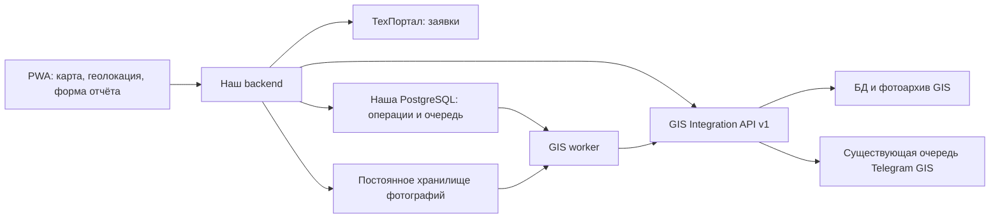

# Архитектура интеграции с Точка GIS

Дата: 16.09.2026. Статус: архитектура принята, реализация запланирована.
План работ: [gis-implementation-plan.md](gis-implementation-plan.md).

## Назначение и обязательные правила

Интеграция решает две задачи:

1. Отдельная вкладка карты в PWA: местоположение монтажника, слои сети,
   карточки и выбор объекта.
2. Отправка отчёта в GIS при закрытии заявки на подключение.

При закрытии подключения монтажник обязательно выбирает существующий объект
сети. Без выбранного объекта сформировать отчёт нельзя. Новый сценарий закрытия
подключения требует этот отчёт: backend отклоняет запрос без `feature_id` до
изменения заявки в ТехПортале. Ограничение проверяется сервером, а не только UI.
Сохранённую связь можно подставить в форму, но объект должен быть показан
монтажнику для подтверждения. Ближайший объект автоматически не назначается.

Непривязанные отчёты и создание объектов сети из PWA не входят в первую версию.
Если нужного объекта нет, его добавляют штатными средствами GIS, затем выбирают
в PWA. Закрытие ремонтов сохраняет свой отдельный сценарий.

`tochka-gis` — внешний проект. Локальный каталог служит справочным исходным кодом
и не включается в репозиторий PWA. Изменения GIS готовятся в отдельном checkout
его репозитория и передаются PR. Этот документ не означает, что PR уже создан
или изменения установлены на сервере.

## Компоненты и ответственность



- PWA отображает карту и получает координаты средствами устройства.
- Наш backend аутентифицирует пользователя, проверяет принадлежность заявки,
  готовит отчёт и вызывает внешние системы через адаптеры.
- ТехПортал остаётся источником состояния заявки.
- GIS остаётся источником геометрии, карточек и принятых отчётов.
- Наша БД хранит операции закрытия, неизменяемые снимки отчётов и задания доставки.
- Фоновый обработчик продолжает операции после перезапуска и сетевых сбоев.

## GIS Integration API

Первая версия — отдельный модуль `/integration/v1` внутри приложения GIS.
Отдельный процесс с прямым доступом к его БД пока не нужен: он дублировал бы
бизнес-логику и усиливал зависимость от схемы хранения.

Общая логика чтения и сохранения отчётов выделяется из текущих обработчиков в
сервисные функции. Браузерные маршруты GIS сохраняют прежнюю cookie-авторизацию.
Интеграционные маршруты используют отдельный контекст сервисного клиента;
подмена его локальным владельцем GIS недопустима.

Предлагаемый контракт, подлежащий фиксации в OpenAPI на этапе 1:

| Метод | Назначение |
|---|---|
| `GET /integration/v1/maps` | Карты, границы и начальный обзор |
| `GET /integration/v1/maps/{id}/layers` | Слои карты |
| `GET /integration/v1/maps/{id}/features?bbox=…&zoom=…&layers=…` | Геометрия видимой области |
| `GET /integration/v1/features/{id}` | Карточка и принадлежность объекта карте/слою |
| `GET /integration/v1/maps/{id}/search?q=…` | Поиск объекта, включая поиск рядом по координатам |
| `GET /integration/v1/assets/{id}` | Значки объектов |
| `POST /integration/v1/reports` | Приём отчёта и фотографий |
| `GET /integration/v1/reports/by-external-id/{id}` | Проверка ранее отправленного отчёта |

Данные геометрии — GeoJSON, WGS84, координаты `[longitude, latitude]`.
Идентичность объекта задаётся UUID, не названием, номером или слоем.
Карточки и поисковые ответы содержат только необходимые PWA поля; служебные
данные, UserSide-ссылки и внутренние пути файлов автоматически не публикуются.

Контракт определяет ограничения bbox, масштаба, количества слоёв, объёма ответа,
длины поиска, тайм-аутов и частоты запросов. При превышении лимита объектов
возвращается явный признак неполного результата; клиент предлагает приблизить
карту. Полная геометрия карточки отделена от упрощённой геометрии отображения.
Векторные тайлы — возможное последующее улучшение после измерений.

Ошибки имеют стабильный машинный `code`, безопасное сообщение и `request_id`.
OpenAPI фиксирует схемы, примеры, обязательные поля, лимиты и коды ответа.

## Авторизация и границы доступа

Backend обращается к GIS по HTTPS с `Authorization: Bearer <token>`.
Секрет не передаётся браузеру, не включается в URL и журналы. На стороне GIS
хранится проверочное значение токена, поддерживаются отзыв и ротация.
Идентичность интеграционного клиента сохраняется при ротации ключа.

Пользовательские роли GIS в первой версии не синхронизируются. Все пользователи
интеграции получают одинаковый опубликованный набор карт и слоёв; при
необходимости он ограничивается настройкой клиента целиком.

Фиксированные возможности токена: читать карту и добавлять отчёт. Редактирование
геометрии, импорт, экспорт, удаление и управление пользователями не доступны.
Интеграционный токен не открывает существующий браузерный `/api/*`.

Наш backend сохраняет проверки сессии, CSRF и принадлежности заявки. Внешний
автор отчёта берётся из серверного Actor. GIS доверяет атрибуции от данного
сервисного клиента и отдельно фиксирует источник; это не вход монтажника в GIS.
CORS на GIS для PWA не требуется: обращения выполняет backend.

## Карта и выбор объекта в PWA

На frontend реализуется собственный экран карты. Наш backend предоставляет
узкий `/api/gis/*` с нормализованными ответами через GIS-адаптер, без универсального
проксирования произвольных путей и методов.

При открытии вкладки запрашивается разрешение на геолокацию, показываются маркер
и круг точности. Отказ или тайм-аут не блокирует карту: используется сохранённый
либо начальный обзор, доступны ручное перемещение и выбор региона.
Обновления положения работают, пока экран активен; фоновой слежки нет.
Координаты монтажника не требуется хранить или передавать в GIS для показа маркера.

Объекты загружаются по видимой области с задержкой между запросами и отменой
устаревших ответов. Смена карты сбрасывает несовместимый выбор слоёв. Значки
получаются через backend, ссылки с сервисным токеном не используются.

Подложка (дороги/спутник) не входит в GeoJSON сети. Перед реализацией выбирается
провайдер, проверяются условия использования, доменный ключ и атрибуция. Для
внешней подложки допустимы прямые браузерные запросы, если это предусмотрено
провайдером; данные GIS всегда идут через наш backend.

В форме закрытия подключения используется тот же компонент выбора объекта:
поиск/карта → карточка → подтверждение. Хранятся UUID и снимок названия/слоя для
показа пользователю. Backend проверяет существование и доступность объекта до
начала закрытия; GIS повторяет проверку при приёме отчёта. Перенос или
переименование не меняют UUID. Удаление между проверкой и доставкой переводит
операцию в явное состояние, требующее вмешательства, без смены объекта наугад.

## Отчёт и фотографии

Снимок отчёта содержит:

- `external_report_id` — стабильный UUID, не меняющийся при повторных попытках;
- ID заявки ТехПортала и ID операции закрытия;
- обязательный `feature_id`;
- ID и имя монтажника из серверного контекста;
- время выполнения работ, текст и фотографии;
- источник интеграции, определяемый аутентифицированным клиентом.

GIS добавляет собственное время приёма и ID отчёта. Не требуется локальный
аккаунт GIS для каждого монтажника. Для внешней идентичности и идемпотентности
добавляется отдельная квитанция/метаданные с уникальностью
`(integration_client_id, external_report_id)`.

Первая версия использует multipart: JSON-метаданные и файлы. Базовые ограничения
совместимы с текущими фотоотчётами GIS: до 5 фотографий JPEG/PNG/WebP по 10 МиБ,
проверка контейнера и размеров. Точные лимиты, включая суммарный размер запроса,
фиксируются в OpenAPI и согласуются с reverse proxy. Base64 в JSON не нужен.

Фото сначала сохраняются в постоянное приватное хранилище нашего приложения;
в БД фиксируются размер, хеш и ключ файла. До закрытия проверяется, что снимок
отчёта и все вложения сохранены. Частичная загрузка не запускает закрытие.
Временные файлы запроса не являются очередью. После подтверждения GIS локальные
копии удаляются по настроенному сроку хранения; неподтверждённые вложения
сохраняются. Нужны очистка осиротевших загрузок, контроль места и резервирование.

GIS подтверждает приём только после сохранения отчёта и доступных вложений.
Запись отчёта, квитанция и задание существующей Telegram-очереди фиксируются
одной транзакцией БД. Файловое хранилище не участвует в SQL-транзакции: реализация
должна обеспечивать подготовку файлов до COMMIT и восстановление/очистку после
сбоя. Подтверждённый отчёт не может ссылаться на исчезающий временный файл.

Отметка `closure_full` не входит в MVP интеграции: существующий механизм GIS
меняет через неё состояние и цвет объекта. Возможность «добавить отчёт» сама
по себе не даёт права менять карту.

## Закрытие и доставка

В начале backend проверяет исполнителя, тип и актуальное состояние заявки,
выбранный объект, данные отчёта и постоянное сохранение вложений.
Далее выполняется сохраняемая операция:

1. Сохранить операцию закрытия и неизменяемый снимок отчёта в нашей БД.
2. Запросить закрытие заявки в ТехПортале.
3. После подтверждения одной локальной транзакцией зафиксировать закрытие и
   создать задание доставки (transactional outbox).
4. Worker отправляет отчёт в GIS и сохраняет полученный ID.
5. UI показывает раздельно состояние заявки и доставки отчёта.

Состояния закрытия: `prepared`, `closing`, `closure_unknown`, `closed`,
`closure_failed`, `needs_review`. Состояния доставки: `not_ready`, `pending`,
`sending`, `retry_wait`, `delivered`, `needs_attention`. Закрытие заявки не
обозначается успешным до подтверждения ТехПортала.

Общей транзакции между нашей БД, ТехПорталом и GIS нет. После тайм-аута
ТехПортала worker перечитывает заявку по ID; отправка отчёта разрешена только
после подтверждения закрытия. Если текущего состояния недостаточно для
установления результата именно этой операции, нужна ручная сверка. Неизвестный
результат не превращается автоматически в успешное закрытие.

Повтор закрытия с комментариями нельзя выполнять вслепую: возможность
идемпотентности/сверки ТехПортала проверяется при реализации. Нельзя затирать
чужие изменения тегов. Фоновая сверка работает по ID, а не ограничивается
экранами «Сегодня/Завтра» или действующей браузерной сессией.

Outbox и операции хранятся в PostgreSQL. Worker использует аренду задания,
блокировки, ограниченные тайм-ауты и backoff с jitter. После перезапуска истёкшая
аренда позволяет продолжить обработку. Новый брокер сообщений не требуется;
механизмы платежей можно использовать как образец, но GIS имеет собственные
таблицы, состояния и задания.

Сетевая ошибка/429/временная 5xx вызывает повтор с тем же внешним ID.
Ошибки токена, содержимого, конфликт ID или недоступный объект требуют отдельной
диагностики и не повторяются бесконечно. Исчерпание попыток сохраняет задание
для вмешательства, а не удаляет отчёт.

GIS обрабатывает повтор так:

- тот же внешний ID и одинаковое содержимое — существующий отчёт;
- тот же ID и другое содержимое — `409 Conflict`;
- конкурентные запросы создают ровно одну запись отчёта и Telegram-задание.

Сравнивается каноническое содержимое метаданных и хеши файлов, а не сырые байты
multipart. Проверка сохранённой квитанции должна позволять установить результат
даже после последующего удаления объекта, без создания нового отчёта.

Повтор нажатия и сетевой повтор используют прежнюю операцию. Конкурентные
закрытия одной заявки защищаются ограничениями БД. Новая операция и новый
внешний ID допускаются после подтверждённого повторного открытия заявки;
предыдущие отчёты остаются историей. Исправление отклонённого снимка отчёта
оформляется явно с новой идентичностью и связью с исходной операцией, а не
подменяет содержимое ранее использованного ID.

## Интерфейс и эксплуатация

UI различает: «Закрытие выполняется», «Результат закрытия уточняется»,
«Заявка закрыта, отчёт ожидает отправки», «Отчёт передан в GIS»,
«Отчёт требует внимания». Недоступность GIS после подготовки отчёта не отменяет
подтверждённое закрытие. Недоступность GIS при первичном выборе/проверке объекта
может задержать начало операции; офлайн-закрытие не входит в MVP.

Telegram отправляет GIS по своей существующей маршрутизации карты. Наш backend
не дублирует эту отправку. Подтверждение GIS означает сохранение отчёта, а не
успешную доставку Telegram; повтор API не гарантирует exactly-once во внешнем
Telegram, если ответ самого Telegram потерян.

Логи связываются через ID операции, внешний ID отчёта, ID заявки и request ID.
Не логируются токены, фотографии и полный текст отчёта. Метрики: возраст очереди,
число повторов, ошибки авторизации, неопределённые закрытия и доставка.
Readiness нашего приложения не должна целиком зависеть от доступности GIS.

### Локальный контейнерный контур

Для сквозной проверки GIS запускается отдельным контейнером из внешних
исходников. Он не публикует порт на хост и доступен только backend PWA через
общую сеть `tochka-gis-local_default` по адресу `http://gis:18770`.

```bash
(cd tochka-gis/current && docker compose up -d --build gis)
docker compose -f compose.yaml -f compose.gis-local.yaml up -d --build api frontend
```

В корневом `.env` PWA должен быть тот же `GIS_API_TOKEN`, что и в закрытом
`tochka-gis/current/.env`. Файл `compose.gis-local.yaml` предназначен только
для разработки: production использует опубликованный HTTPS-адрес GIS.

## Решения перед включением

- Согласовать с командой GIS опубликованные карты и допустимые типы объектов
  для отчёта подключения; обязательность конкретного UUID уже принята.
- Выбрать подложку и параметры хранения фото/повторных попыток по нагрузке.
- Проверить семантику ТехПортала при повторе закрытия и возможность надёжной
  сверки; при отсутствии доказательства результата использовать `needs_review`.
- Согласовать rollout для всех каналов закрытия подключения: после включения
  обязательного отчёта старый endpoint/другой канал не должен обходить проверку.
  Ремонты не затрагиваются; закрытия напрямую в ТехПортале не охватываются этим
  процессом без отдельной интеграции событий.

## Источники

- Исходники внешнего проекта `tochka-gis/current`: `server.ts`,
  `report-routes.ts`, `auth-routes.ts`, `lib/runtime-config.ts`,
  `lib/telegram-reports.ts`, `prisma/schema.prisma` (снимок 0.2.20).
- Наш текущий сценарий: [tickets.md](tickets.md), `backend/app/tickets.py`.
- [Geolocation API](https://developer.mozilla.org/en-US/docs/Web/API/Geolocation_API).
- [Transactional outbox](https://microservices.io/patterns/data/transactional-outbox.html).
