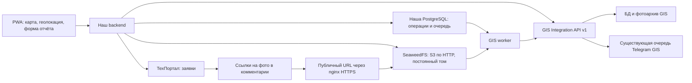

# Архитектура интеграции с Точка GIS

Обновлено: 17.09.2026. Статус: этапы 1–2 реализованы по подтверждению владельца;
отправка отчётов с карты работает. Сценарий этапа 3 согласован и реализуется.
План работ: [gis-implementation-plan.md](gis-implementation-plan.md).

## Назначение и обязательные правила

Интеграция решает две задачи:

1. Отдельная вкладка карты в PWA: местоположение монтажника, слои сети,
   карточки и выбор объекта.
2. Обязательный отчёт при отметке выполнения подключения: всегда в ТехПортал,
   дополнительно в GIS, только если монтажник выбрал объект карты.

Тикет в ТехПортале не закрываем: как в существующем сценарии ремонтов,
добавляем тег выполнения и комментарий одним запросом. Все остальные теги
заявки обязательно сохраняются. Основа реализации — действующий путь ремонтов.

Отчёт подключения содержит два независимых текста. Текст ТехПортала обязателен,
если не приложена фотография; при наличии фотографии он может быть пустым. Текст
GIS используется только при выбранном объекте карты. Если объект выбран и нет
фотографий, текст GIS обязателен для формирования GIS-отчёта. Backend проверяет
эти правила до записи в ТехПортал. `feature_id` необязателен для выполнения заявки
и обязателен только для отправки в GIS. Это заменяет прежнее требование
обязательного объекта карты.

Без объекта отчёт отправляется только в ТехПортал; очередь GIS и архив ожидания
последующей привязки не создаются. Если объект выбран, монтажник явно подтверждает
его в карточке; ближайший объект автоматически не назначается. Создание объектов
сети из PWA не входит в этот этап. Ремонты сохраняют существующее требование
комментария и сценарий отметки выполнения.

`tochka-gis` — внешний проект. Локальный каталог служит справочным исходным кодом
и не включается в репозиторий PWA. Изменения GIS готовятся в отдельном checkout
его репозитория и передаются PR. Этот документ не означает, что PR уже создан
или изменения установлены на сервере.

## Компоненты и ответственность



- PWA отображает карту и получает координаты средствами устройства.
- Наш backend аутентифицирует пользователя, проверяет принадлежность заявки,
  готовит отчёт и вызывает внешние системы через адаптеры.
- ТехПортал остаётся источником состояния заявки.
- GIS остаётся источником геометрии, карточек и принятых отчётов.
- Наша БД хранит операции отметки выполнения и данные восстановления; при выборе
  объекта — неизменяемые снимки и задания доставки GIS.
- SeaweedFS хранит фотографии, на которые ссылаются комментарии ТехПортала.
  Удаление, сроки хранения и резервирование — ответственность S3-сервиса.
- Фоновый обработчик продолжает операции после перезапуска и сетевых сбоев.

## GIS Integration API

Первая версия — отдельный модуль `/integration/v1` внутри приложения GIS.
Отдельный процесс с прямым доступом к его БД пока не нужен: он дублировал бы
бизнес-логику и усиливал зависимость от схемы хранения.

Общая логика чтения и сохранения отчётов выделяется из текущих обработчиков в
сервисные функции. Браузерные маршруты GIS сохраняют прежнюю cookie-авторизацию.
Интеграционные маршруты используют отдельный контекст сервисного клиента;
подмена его локальным владельцем GIS недопустима.

Предлагаемый контракт, подлежащий фиксации в OpenAPI на этапе 1:

| Метод | Назначение |
|---|---|
| `GET /integration/v1/maps` | Карты, границы и начальный обзор |
| `GET /integration/v1/maps/{id}/layers` | Слои карты |
| `GET /integration/v1/maps/{id}/features?bbox=…&zoom=…&layers=…` | Геометрия видимой области |
| `GET /integration/v1/features/{id}` | Карточка и принадлежность объекта карте/слою |
| `GET /integration/v1/maps/{id}/search?q=…` | Поиск объекта, включая поиск рядом по координатам |
| `GET /integration/v1/assets/{id}` | Значки объектов |
| `POST /integration/v1/reports` | Приём отчёта и фотографий |
| `GET /integration/v1/reports/by-external-id/{id}` | Проверка ранее отправленного отчёта |

Данные геометрии — GeoJSON, WGS84, координаты `[longitude, latitude]`.
Идентичность объекта задаётся UUID, не названием, номером или слоем.
Карточки и поисковые ответы содержат только необходимые PWA поля; служебные
данные, UserSide-ссылки и внутренние пути файлов автоматически не публикуются.

Контракт определяет ограничения bbox, масштаба, количества слоёв, объёма ответа,
длины поиска, тайм-аутов и частоты запросов. При превышении лимита объектов
возвращается явный признак неполного результата; клиент предлагает приблизить
карту. Полная геометрия карточки отделена от упрощённой геометрии отображения.
Векторные тайлы — возможное последующее улучшение после измерений.

Ошибки имеют стабильный машинный `code`, безопасное сообщение и `request_id`.
OpenAPI фиксирует схемы, примеры, обязательные поля, лимиты и коды ответа.

## Авторизация и границы доступа

Backend обращается к GIS по HTTPS с `Authorization: Bearer <token>`.
Секрет не передаётся браузеру, не включается в URL и журналы. На стороне GIS
хранится проверочное значение токена, поддерживаются отзыв и ротация.
Идентичность интеграционного клиента сохраняется при ротации ключа.

Пользовательские роли GIS в первой версии не синхронизируются. Все пользователи
интеграции получают одинаковый опубликованный набор карт и слоёв; при
необходимости он ограничивается настройкой клиента целиком.

Фиксированные возможности токена: читать карту и добавлять отчёт. Редактирование
геометрии, импорт, экспорт, удаление и управление пользователями не доступны.
Интеграционный токен не открывает существующий браузерный `/api/*`.

Наш backend сохраняет проверки сессии, CSRF и принадлежности заявки. Внешний
автор отчёта берётся из серверного Actor. GIS доверяет атрибуции от данного
сервисного клиента и отдельно фиксирует источник; это не вход монтажника в GIS.
CORS на GIS для PWA не требуется: обращения выполняет backend.

Видимость вкладки карты и выбора объекта при выполнении заявки задаёт
`GIS_VISIBLE_TECHPORTAL_ROLES`: это список исходных ролей (поле `status`) из
ТехПортала через запятую, сравнение выполняется без учёта регистра. Пользователь
вне списка не видит эти элементы, а backend отклоняет его прямые обращения к
`/api/gis/*` и попытку передать `feature_id` при выполнении подключения.

Загрузка фотографий при выполнении подключения доступна только при полной
S3-конфигурации. В сессии для этого возвращается capability `connection_photos`;
без неё поле фотографий скрыто, текст отчёта ТехПортала обязателен и backend
отклоняет загруженные файлы. Фотографии самостоятельного отчёта карты по-прежнему
передаются напрямую в GIS и от S3 не зависят.

## Карта и выбор объекта в PWA

На frontend реализуется собственный экран карты. Наш backend предоставляет
узкий `/api/gis/*` с нормализованными ответами через GIS-адаптер, без универсального
проксирования произвольных путей и методов.

При открытии вкладки запрашивается разрешение на геолокацию, показываются маркер
и круг точности. Отказ или тайм-аут не блокирует карту: используется сохранённый
либо начальный обзор, доступны ручное перемещение и выбор региона.
Обновления положения работают, пока экран активен; фоновой слежки нет.
Координаты монтажника не требуется хранить или передавать в GIS для показа маркера.

Объекты загружаются по видимой области с задержкой между запросами и отменой
устаревших ответов. Смена карты сбрасывает несовместимый выбор слоёв. Значки
получаются через backend, ссылки с сервисным токеном не используются.

Подложка (дороги/спутник) не входит в GeoJSON сети. Перед реализацией выбирается
провайдер, проверяются условия использования, доменный ключ и атрибуция. Для
внешней подложки допустимы прямые браузерные запросы, если это предусмотрено
провайдером; данные GIS всегда идут через наш backend.

В форме отметки выполнения подключения используется необязательный выбор объекта:
поиск/карта → карточка → подтверждение. Хранятся UUID и снимок названия/слоя для
показа пользователю. Backend проверяет существование и доступность объекта до
начала операции, если объект выбран; GIS повторяет проверку при приёме отчёта. Перенос или
переименование не меняют UUID. Удаление между проверкой и доставкой переводит
операцию в явное состояние, требующее вмешательства, без смены объекта наугад.

Выбор из формы выполнения открывает тот же полноценный экран карты, что и вкладка
«Карта»: доступны ручное перемещение, масштаб, геолокация и смена подложки. В этом
режиме все слои текущей карты включены принудительно и отдельный выбор слоёв не
показывается. Последняя выбранная карта сохраняется в `localStorage` и используется
при следующем открытии формы; обзор карты сохраняется отдельно для каждой карты.

## Отчёт и фотографии

Данные операции содержат ID заявки, ID операции, автора из серверного контекста,
время работ, отдельные `techportal_text` и `gis_text`, ключи/хеши/размеры фото и
сформированный комментарий ТехПортала.
Без объекта эти данные служат восстановлению операции, а не последующей привязке.

Для отправки в GIS неизменяемый снимок содержит:

- `external_report_id` — стабильный UUID, не меняющийся при повторных попытках;
- настоящий `ticket_id` заявки ТехПортала и `completion_id` операции отметки выполнения;
- обязательный `feature_id`;
- ID, имя и фамилия монтажника из серверного контекста;
- время выполнения работ, `gis_text` и фотографии;
- источник интеграции, определяемый аутентифицированным клиентом.

GIS добавляет собственное время приёма и ID отчёта. Не требуется локальный
аккаунт GIS для каждого монтажника. Для внешней идентичности и идемпотентности
добавляется отдельная квитанция/метаданные с уникальностью
`(integration_client_id, external_report_id)`.

Первая версия использует multipart: JSON-метаданные и файлы. Базовые ограничения
совместимы с текущими фотоотчётами GIS: до 5 фотографий JPEG/PNG/WebP по 10 МиБ,
проверка контейнера и размеров. Точные лимиты, включая суммарный размер запроса,
фиксируются в OpenAPI и согласуются с reverse proxy. Base64 в JSON не нужен.

Фото сначала сохраняются в bucket SeaweedFS; до записи в ТехПортал проверяется
успешная загрузка всех вложений. Частичная загрузка не запускает отметку выполнения.
Временные файлы запроса не являются очередью. Worker получает исходные байты из
S3 по сохранённым ключам и отправляет их в GIS через существующий multipart API.

SeaweedFS разворачивается в контейнере с постоянным томом и HTTP S3 endpoint.
Backend использует HTTP во внутренней сети. Публичный HTTPS на nginx настраивает
владелец инфраструктуры; планируемый адрес — `https://s2.svc.point.online`,
но сервис и приложение не привязываются к конкретному домену.

Compose перед запуском SeaweedFS генерирует S3 IAM-конфигурацию из ключа и
секрета в `.env`; backend получает административные S3-права, а
анонимному клиенту разрешено только чтение объектов по постоянным ссылкам.
Одноразовый `seaweedfs-init` создаёт bucket из `S3_BUCKET`, если его ещё нет.
S3 API опубликован только на loopback хоста для внешнего nginx. Без S3-ключей
локальный Compose оставляет SeaweedFS без авторизации, но backend не принимает
фото, поскольку его собственная S3-конфигурация остаётся неполной.

Планируемые параметры `.env`: `S3_ENDPOINT_URL`, `S3_ACCESS_KEY_ID`,
`S3_SECRET_ACCESS_KEY`, `S3_BUCKET`, `S3_REGION` и `S3_PUBLIC_BASE_URL`.
Последний задаёт публичную базу именно для объектов выбранного bucket
(включая путь bucket, если этого требует nginx); URL фото — эта база плюс
экранированный ключ объекта. Внутренний endpoint и публичный URL независимы.
Credentials остаются на backend. Загрузка и listing требуют авторизации;
чтение конкретного файла по постоянной ссылке доступно без авторизации.
Ключи непредсказуемы, не содержат персональных данных; ссылки не имеют срока
действия и не являются временными presigned URL.

Комментарий ТехПортала начинается с имени и фамилии монтажника, затем содержит
`techportal_text` и отдельные строки ссылок на фотографии.
Допустим комментарий только из фотографий: в этом случае он содержит ссылки.
`gis_text` в ТехПортал не передаётся. В GIS передаётся исходный текст отчёта и
объект `subscriber` с логином клиента и адресом. `techportal_text` в GIS не
передаётся.
Приложение не удаляет файлы после доставки GIS, снятия отметки или ошибки операции,
не управляет lifecycle, очисткой незавершённых загрузок и backup/restore S3.
Все эти операции выполняются на стороне S3-сервиса; удаление объекта делает
ссылку в старом комментарии недоступной.

Самостоятельные отчёты из карты используют текущую реализацию и согласованный
временный `ticket_id=1`. Для отчётов выполнения заявки используется её настоящий
ID. Самостоятельный отчёт с карты автоматически к выполнению заявки не привязывается.

GIS подтверждает приём только после сохранения отчёта и доступных вложений.
Запись отчёта, квитанция и задание существующей Telegram-очереди фиксируются
одной транзакцией БД. Файловое хранилище не участвует в SQL-транзакции: реализация
должна обеспечивать подготовку файлов до COMMIT и восстановление/очистку после
сбоя. Подтверждённый отчёт не может ссылаться на исчезающий временный файл.

Отметка `closure_full` не входит в MVP интеграции: существующий механизм GIS
меняет через неё состояние и цвет объекта. Возможность «добавить отчёт» сама
по себе не даёт права менять карту.

## Отметка выполнения и доставка

В начале backend проверяет исполнителя, тип и актуальное состояние заявки,
выбранный объект (если указан), данные отчёта и сохранение вложений в S3.
Далее выполняется сохраняемая операция:

1. Сохранить операцию, оба текста, ключи фото и итоговый комментарий в нашей БД.
2. Перечитать актуальные теги и одним запросом передать в ТехПортал комментарий
   и тег выполнения, сохранив все остальные теги. Использовать реализацию ремонтов.
3. После подтверждения одной локальной транзакцией зафиксировать выполнение;
   только при выбранном объекте создать задание GIS (transactional outbox).
4. Worker отправляет текст и файлы в GIS через текущий API и сохраняет полученный ID.
5. UI показывает раздельно состояние заявки и доставки отчёта.

Состояния операции: `prepared`, `marking`, `completion_unknown`, `completed`,
`completion_failed`, `needs_review`. Состояния доставки: `not_requested` (нет
объекта), `not_ready`, `pending`, `sending`, `retry_wait`, `delivered`,
`needs_attention`. Выполнение не обозначается успешным до подтверждения ТехПортала.

Общей транзакции между нашей БД, ТехПорталом и GIS нет. После тайм-аута
ТехПортала worker перечитывает заявку по ID; отправка отчёта разрешена только
после подтверждения записи комментария и тега. Если текущего состояния недостаточно для
установления результата именно этой операции, нужна ручная сверка. Неизвестный
результат не превращается автоматически в успешную отметку выполнения.

Повтор записи тега с комментарием нельзя выполнять вслепую: возможность
идемпотентности/сверки ТехПортала проверяется при реализации. Нельзя затирать
чужие изменения тегов, включая конкурентные правки. Механизм защиты от гонки
между чтением и записью проверяется при реализации; одного чтения недостаточно
для гарантии сохранности конкурентных изменений. Фоновая сверка работает по ID, а не ограничивается
экранами «Сегодня/Завтра» или действующей браузерной сессией.

Outbox и операции хранятся в PostgreSQL. Worker использует аренду задания,
блокировки, ограниченные тайм-ауты и backoff с jitter. После перезапуска истёкшая
аренда позволяет продолжить обработку. Новый брокер сообщений не требуется;
механизмы платежей можно использовать как образец, но GIS имеет собственные
таблицы, состояния и задания.

Сетевая ошибка/429/временная 5xx вызывает повтор с тем же внешним ID.
Ошибки токена, содержимого, конфликт ID или недоступный объект требуют отдельной
диагностики и не повторяются бесконечно. Исчерпание попыток сохраняет задание
для вмешательства, а не удаляет отчёт.

GIS обрабатывает повтор так:

- тот же внешний ID и одинаковое содержимое — существующий отчёт;
- тот же ID и другое содержимое — `409 Conflict`;
- конкурентные запросы создают ровно одну запись отчёта и Telegram-задание.

Сравнивается каноническое содержимое метаданных и хеши файлов, а не сырые байты
multipart. Проверка сохранённой квитанции должна позволять установить результат
даже после последующего удаления объекта, без создания нового отчёта.

Повтор нажатия и сетевой повтор используют прежнюю операцию. Конкурентные
отметки выполнения одной заявки защищаются ограничениями БД. Снятие отметки
не удаляет комментарии, фотографии и отчёты GIS. После подтверждённого снятия
отметки новое выполнение требует нового отчёта, операции и внешнего ID;
предыдущие отчёты остаются историей. Исправление отклонённого снимка отчёта
оформляется явно с новой идентичностью и связью с исходной операцией, а не
подменяет содержимое ранее использованного ID.

## Интерфейс и эксплуатация

Экран открывается из карточки подключения, в том числе длительным нажатием:
текст ТехПортала/текст GIS/фото → «Объект GIS — необязательно» → кнопка
«Отметить выполненной».
Выбор объекта: карта → карточка → явное подтверждение → возврат в форму.
Переходы между формой и картой сохраняют введённые данные. Под кнопкой указано:
отчёт попадёт в ТехПортал, а при выбранном объекте — также в GIS.

UI различает: «Загружаем фотографии», «Ставим отметку выполнения»,
«Результат уточняется», «Заявка отмечена выполненной. Отчёт добавлен в ТехПортал»,
«Отчёт отправляется в GIS», «Отчёт передан в GIS», «Отчёт требует внимания».
Без объекта не показываем ожидание GIS. После сохранения операции обработка
продолжается при уходе с экрана; при возврате восстанавливается её статус.
Повторное нажатие не создаёт новую операцию. Неопределённый результат требует
сверки, а не повторного предложения отметить заявку выполненной.

Ошибка GIS не отменяет подтверждённую отметку и комментарий в ТехПортале;
доставка повторяется автоматически с прежним снимком и ID. Недоступность GIS
при первичном выборе/проверке может задержать операцию с объектом; пользователь
может явно убрать выбор до отправки. Сценарий без объекта не зависит от GIS.
Офлайн-отметка выполнения не входит в MVP.

Telegram отправляет GIS по своей существующей маршрутизации карты. Наш backend
не дублирует эту отправку. Подтверждение GIS означает сохранение отчёта, а не
успешную доставку Telegram; повтор API не гарантирует exactly-once во внешнем
Telegram, если ответ самого Telegram потерян.

Логи связываются через ID операции, внешний ID отчёта, ID заявки и request ID.
Не логируются токены, фотографии и полный текст отчёта. Метрики: возраст очереди,
число повторов, ошибки авторизации, неопределённые результаты отметки и доставка.
Readiness нашего приложения не должна целиком зависеть от доступности GIS.

### Локальный контейнерный контур

Для сквозной проверки GIS запускается отдельным контейнером из внешних
исходников. Он не публикует порт на хост и доступен только backend PWA через
общую сеть `tochka-gis-local_default` по адресу `http://gis:18770`.

```bash
(cd tochka-gis/current && docker compose up -d --build gis)
docker compose -f compose.yaml -f compose.gis-local.yaml up -d --build api frontend
```

В корневом `.env` PWA должен быть тот же `GIS_API_TOKEN`, что и в закрытом
`tochka-gis/current/.env`. Файл `compose.gis-local.yaml` предназначен только
для разработки: production использует опубликованный HTTPS-адрес GIS.

## Решения перед включением

- Согласовать с командой GIS опубликованные карты и допустимые типы объектов
  для отчёта подключения; UUID обязателен только для отправки в GIS.
- Настроить SeaweedFS, bucket, внутренний endpoint, публичный URL и параметры повторов.
- Проверить семантику ТехПортала при повторе записи комментария/тега и возможность надёжной
  сверки; при отсутствии доказательства результата использовать `needs_review`.
- Согласовать rollout для всех каналов отметки выполнения подключения: после включения
  обязательного отчёта старый endpoint/другой канал не должен обходить проверку.
  Ремонты не затрагиваются; отметки напрямую в ТехПортале не охватываются этим
  процессом без отдельной интеграции событий.

## Источники

- Исходники внешнего проекта `tochka-gis/current`: `server.ts`,
  `report-routes.ts`, `auth-routes.ts`, `lib/runtime-config.ts`,
  `lib/telegram-reports.ts`, `prisma/schema.prisma` (снимок 0.2.20).
- Наш текущий сценарий: [tickets.md](tickets.md), `backend/app/tickets.py`.
- [Geolocation API](https://developer.mozilla.org/en-US/docs/Web/API/Geolocation_API).
- [Transactional outbox](https://microservices.io/patterns/data/transactional-outbox.html).
